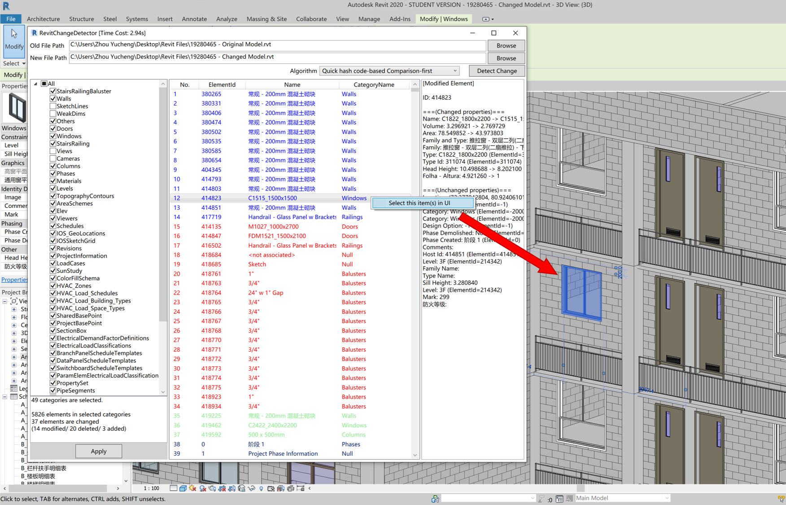

# RevitDiff

A Revit add-in to detect the difference of two Autodesk Revit models. 

This algorithm uses hash code to accelerate the detection process, and can avoid the detection of meaningless changes in Revit models. It can be used with the repo [Design-Change-BIM-Models](https://github.com/Zhou-Yucheng/Design-Change-BIM-Models)

This repo contains codes for the following paper:  
Lin, J.-R., & Zhou, Y.-C. (2020). Semantic classification and hash code accelerated detection of design changes in BIM models. Automation in Construction, 115, 103212. https://doi.org/10.1016/j.autcon.2020.103212

